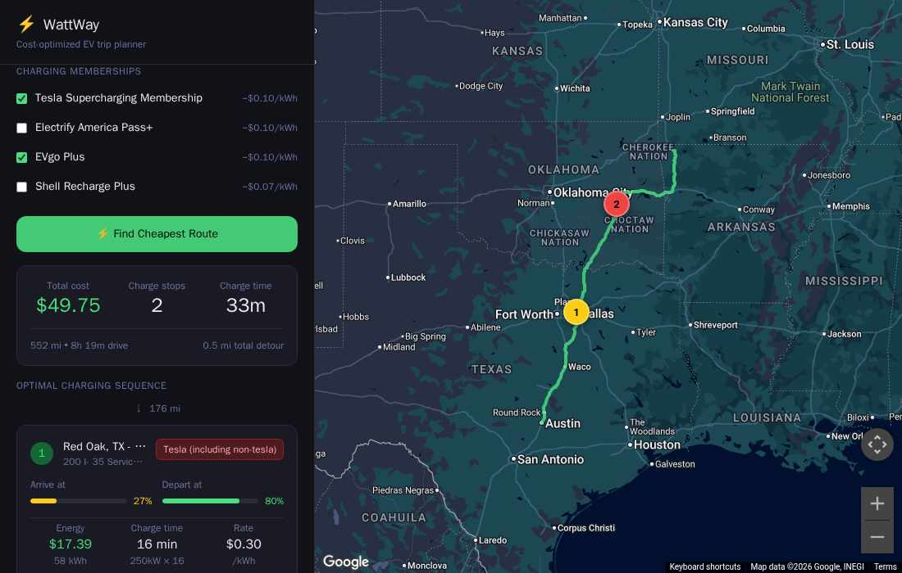

# WattWay ⚡

**Cost-optimized EV trip planner.** Most EV apps find chargers — WattWay finds the *cheapest realistic* way to get from A to B, picking a minimal sequence of charging stops based on network prices, membership discounts, charger power and reliability, detour distance, and your vehicle's range.

**Lightweight by design.** WattWay is a fully static site — no backend, no
database, no server costs. It's hosted on GitHub Pages at
(**[wattway.net](https://wattway.net/)**),
and your browser does all the work: routing, charger lookup, and stop
optimization run entirely client-side against the Google Maps and Open Charge
Map APIs.



## Features

- **Fewest-stops optimizer** — drives as far as comfortably possible, then picks the best charger near the edge of range; charges only as much as the trip needs (past 80% only when that finishes the trip, with taper-aware time estimates)
- **Multi-stop trips** — add intermediate waypoints; the route and charging plan account for them
- **Required charge at arrival** — tell it how much battery you need on arrival (e.g. 30% to get around town, or 60% for the return leg) and the plan works backward from that
- **Membership pricing** — check the plans you subscribe to (Tesla, EA Pass+, EVgo Plus, Shell Recharge Plus) and member rates apply to matching networks
- **Charger quality heuristics** — penalizes sub-100 kW stations, single-plug sites, and stations not recently verified on Open Charge Map; excludes Tesla-only Superchargers for non-Tesla EVs
- **Published pricing when available** — parses Open Charge Map's `UsageCost` where the community has recorded real rates (marked ✓); otherwise falls back to per-network 2026 rate estimates
- **Per-stop details** — arrival/departure state of charge, energy cost, charge time, leg distances, detours, plus Google reviews and operator-site links
- **Remembers your car and memberships** (localStorage)
- **Current location** as trip origin (browser geolocation; requires localhost or HTTPS)

## How the optimizer works

1. **Route**: Google **Routes API** (`computeRoutes`) with optional intermediate waypoints
2. **Chargers**: all DC fast-charge stations (≥50 kW) within 10 miles of the route from **Open Charge Map**
3. **Pricing**: published OCM rates when present → membership discounts → per-network defaults
4. **Optimization**: greedy fewest-stops forward search
   - tracks state of charge mile by mile; never drops below 10%
   - only considers chargers in the far 45% of current usable range
   - scores candidates on price + detour + slow/single-plug/unverified penalties + low-arrival-SoC comfort penalty
   - charges to exactly what the remaining trip needs (cap 80%, or up to 95% when that completes the trip)

## Setup

### 1. Clone and install

```bash
git clone <this-repo>
cd wattway
npm install
```

### 2. API keys

Keys are NOT committed. For local dev copy `.env.local.example` to `.env.local`; the Pages workflow reads them from GitHub Actions secrets named `GOOGLE_MAPS_KEY` and `OCM_API_KEY`.

**Google Maps Platform** (`NEXT_PUBLIC_GOOGLE_MAPS_KEY`) — [console.cloud.google.com](https://console.cloud.google.com/)
- Enable exactly these APIs: **Maps JavaScript API**, **Routes API**, **Places API (New)**
  (the classic Directions/Places APIs are legacy — new projects can't use them)
- The project must be linked to an **active billing account**; per-SKU free tiers (~10k calls/month) cover personal use
- Restrict the key: *Websites* → your origins (e.g. `http://localhost:3100/*`); *APIs* → the three above
- Note: unlike the legacy Directions web service, the Routes API accepts browser calls with
  website-restricted keys — this setup is intentional and verified working end to end

**Open Charge Map** (`NEXT_PUBLIC_OCM_API_KEY`) — [openchargemap.org](https://openchargemap.org/site/develop/api)
- **Required** (anonymous access was discontinued); free signup

> Both keys are `NEXT_PUBLIC_` and ship in the browser bundle — that's inherent to a client-side maps app. The referrer restriction is what protects the Google key.

### 3. Run (dev)

```bash
npm run dev
```

Open [http://localhost:3000](http://localhost:3000).

### 4. Deploy (GitHub Pages)

Push to `main` — `.github/workflows/pages.yml` builds the static export and
publishes it. Keys come from the `GOOGLE_MAPS_KEY` / `OCM_API_KEY` Actions
secrets and are inlined at build time (`NEXT_PUBLIC_` semantics). Add each
serving origin to the Google key's referrer allowlist.

## Default network prices ($/kWh, 2026 non-member rates)

| Network | Price | Member |
|---------|-------|--------|
| Tesla Supercharger | $0.40 | $0.30 |
| Francis Energy | $0.39 | — |
| ChargePoint | $0.48 | — |
| Shell Recharge | $0.52 | $0.45 |
| EVgo | $0.55 | $0.45 |
| Electrify America | $0.56 | $0.46 |
| Blink | $0.59 | — |
| Other/unknown | $0.45 | — |

Real prices vary by site, time of day, and state. Published OCM rates override these when available (marked ✓ in stop cards). Edit `lib/evDatabase.ts` and `lib/memberships.ts` to tune.

## Vehicle database

15 popular EVs with battery size, range, max charge rate, and efficiency — edit `lib/evDatabase.ts` to add more. Your selection is remembered across visits.

## Architecture notes

- 100% client-side (no server code) — Next.js 15, App Router, Tailwind; all API calls happen in the browser
- Google Maps JS via the v2 functional loader (`setOptions`/`importLibrary`); address search via `PlaceAutocompleteElement` (`gmp-select`)
- Route line drawn from Routes API polyline directly (no extra Directions call)
- Deployed as a static export to GitHub Pages; no server to run or patch

## Roadmap

- [ ] Real-time pricing (would require a commercial feed, e.g. Paren)
- [ ] Time-of-use pricing awareness
- [ ] Multiple route alternatives with cost comparison
- [ ] Share trip link
- [ ] Mobile PWA

## About

Built by **TheSaltyKorean** — more at [thesaltykorean.com](https://thesaltykorean.com).

## License

[PolyForm Noncommercial 1.0.0](LICENSE) — free to use, modify, and share for
any noncommercial purpose. Commercial use is not permitted.
